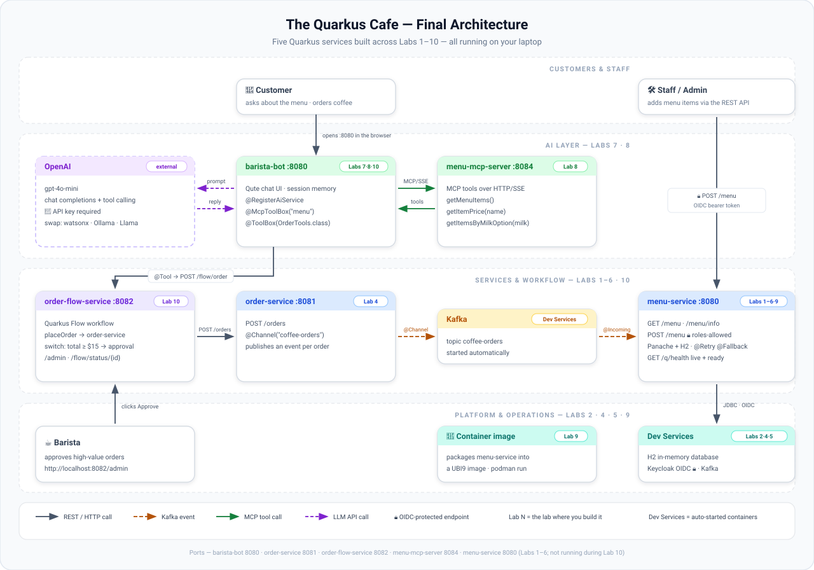

# Quarkus Workshop: From Zero to AI-Powered Microservices

<div style="text-align: center; padding: 2rem 0;">
  <strong style="font-size: 1.2rem;">A 60-minute hands-on workshop for Java developers</strong><br/>
  No prior Quarkus experience needed. Everything runs on your laptop.
</div>

---

## What You'll Build

Imagine you're running **The Quarkus Cafe** — a small coffee shop that needs a real backend system. In the core labs you will build three microservices from scratch:

**`menu-service`** is the heart of the system. It exposes the coffee menu over a REST API, persists items in a database, and enforces security so only authenticated staff can add new items. It also exposes a health endpoint so the platform knows it's alive.

**`order-service`** is the café's order intake. When a customer places an order it publishes the order as an event to a Kafka topic — decoupling the intake from fulfilment so the system stays responsive under load.

**`barista-bot`** is an AI assistant built on top of OpenAI. Customers can ask it anything about the menu — what's in a flat white, whether there's oat milk, what the cheapest drink is — and it answers from the actual menu document, not from guesswork.

The three services talk to each other and to real infrastructure (a database, a Kafka broker, a Keycloak identity provider), all started automatically by Quarkus DevServices — no `docker-compose.yml`, no manual setup.



The optional labs extend this further: **`menu-mcp-server`** exposes the menu as MCP tools the LLM can call directly (Lab 8), and **`order-flow-service`** runs a Quarkus Flow workflow that holds high-value orders for barista approval (Lab 10).

---

## Workshop Schedule

| Time | Lab | Topic | Requires |
|------|-----|-------|---------|
| 00:00 – 05:00 | Intro | Why Quarkus, what we're building | — |
| 05:00 – 17:00 | [Lab 1](lab1-rest.md) | First REST API, Dev Mode, Live Coding, Continuous Testing | — |
| 17:00 – 25:00 | [Lab 2](lab2-panache.md) | Panache ORM + H2 — persist menu items | Lab 1 |
| 25:00 – 31:00 | [Lab 3](lab3-config-health.md) | Config profiles, Health checks, Dev UI tour | Lab 2 |
| 31:00 – 38:00 | [Lab 4](lab4-kafka.md) | Kafka messaging with DevServices | Lab 2 · 🐳 Docker or Podman |
| 38:00 – 45:00 | [Lab 5](lab5-security.md) | OIDC Security + Keycloak DevServices | Lab 2 · 🐳 Docker or Podman |
| 45:00 – 50:00 | [Lab 6](lab6-fault-tolerance.md) | Fault Tolerance — `@Retry`, `@Fallback`, `@Timeout` | Lab 2 |
| 50:00 – 58:00 | [Lab 7](lab7-langchain4j.md) | LangChain4j AI chatbot | 🔑 OpenAI key |
| 58:00 – 60:00 | [Wrap-Up](wrap-up.md) | Native image demo + next steps | — |
| *(optional)* | [Lab 7 — Bonus: Easy RAG](lab7-langchain4j.md#step-6-bonus-easy-rag) | Ground the bot in your menu document | Lab 7 · 🔑 OpenAI key |
| *(optional)* | [Lab 7 — Bonus: Memory](lab7-langchain4j.md#step-7-bonus-conversation-memory-with-memoryid) | Multi-turn conversation with `@MemoryId` | Lab 7 · 🔑 OpenAI key |
| *(optional)* | [Lab 8: MCP Server](lab8-mcp-server.md) | Expose menu as AI tools via MCP | Lab 7 · 🔑 OpenAI key |
| *(optional)* | [Lab 9: Containerization](lab9-containerize.md) | Build a container image with Podman and run it locally | 🐳 Podman or Docker |
| *(optional)* | [Lab 10: Quarkus Flow](lab10-quarkus-flow.md) | Agentic order workflow with barista approval | Labs 4 · 8 · 🔑 OpenAI key |

!!! info "Labs 4 and 5 can be done in either order"
    Both introduce a new DevServices container and both depend on the Panache entity from Lab 2. Neither depends on the other — you can skip one if you're short on time.

!!! tip "Fell behind? Use the solution folder"
    Every lab ships a complete, runnable solution under its `labs/labN-*/` folder — usually in a `solution/` subfolder, though Lab 8 keeps its two projects at the top level. The exact path and commands are in the "Stuck or fell behind?" box at the end of each lab. `cd` there, run `quarkus dev` to catch up, then continue from the next lab.

---

## Prerequisites

Before the workshop, make sure you have everything installed and working.

!!! warning "Do this before you arrive"
    The setup takes 10–15 minutes. Please complete the [Prerequisites](00-prerequisites.md) page **before** the session starts.

| Tool | Required for |
|------|-------------|
| Java 21+ | All labs |
| Maven 3.9+ or Quarkus CLI | All labs |
| Docker Desktop or Podman Desktop | Labs 4, 5, 9, and 10 (DevServices + container builds) |
| OpenAI API key | Labs 7, 8, and 10 (AI chatbot) |
| VS Code or IntelliJ | All labs (recommended) |

---

## 🖥️ Lab Simulations

Want to preview what each lab does before (or without) running it locally?
Each lab has a self-contained interactive simulation — no Quarkus install needed.

!!! tip "Run simulations locally"
    After cloning the repo:
    ```bash
    git clone https://github.com/learn-quarkus/quarkus-beginners-lab
    ```
    Open any file from `labs/simulations/` directly in your browser:

    | Simulation | Open |
    |------------|------|
    | Lab 1 — First REST API | `labs/simulations/lab-1-rest-simulation.html` |
    | Lab 2 — Panache ORM | `labs/simulations/lab-2-panache-simulation.html` |
    | Lab 3 — Config & Health | `labs/simulations/lab-3-config-health-simulation.html` |
    | Lab 4 — Kafka Messaging | `labs/simulations/lab-4-kafka-simulation.html` |
    | Lab 5 — OIDC Security | `labs/simulations/lab-5-security-simulation.html` |
    | Lab 6 — Fault Tolerance | `labs/simulations/lab-6-fault-tolerance-simulation.html` |
    | Lab 7 — AI with LangChain4j | `labs/simulations/lab-7-langchain4j-simulation.html` |
    | Lab 8 — MCP Server | `labs/simulations/lab-8-mcp-server-simulation.html` |
    | Lab 9 — Containerization | `labs/simulations/lab-9-containerization-simulation.html` |
    | Lab 10 — Quarkus Flow | `labs/simulations/lab-10-quarkus-flow-simulation.html` |

    No server, no install — just double-click the file.

---

## Why Quarkus?

Quarkus is a cloud-native Java framework built for speed and developer joy:

- **Live reload** — edit code, save, refresh. No restart. Ever.
- **Dev Services** — add Kafka or Keycloak to `pom.xml` and they start automatically. No `docker-compose.yml`.
- **Dev UI** — a built-in browser dashboard showing every extension, your config, your database, live test results.
- **Native compilation** — compile to a binary that starts in ~20ms and uses 50MB RAM.
- **Unified model** — imperative and reactive code side by side, same project.

---

## Ready?

[→ Set up your environment first](00-prerequisites.md){ .md-button .md-button--primary }
[→ Jump to Lab 1](lab1-rest.md){ .md-button }
